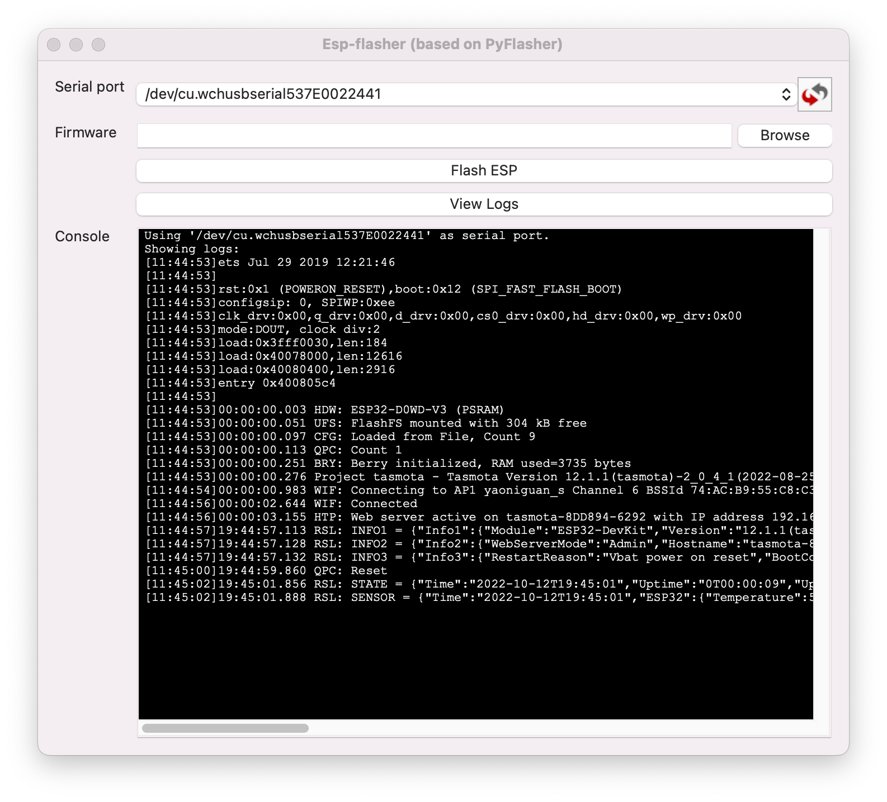
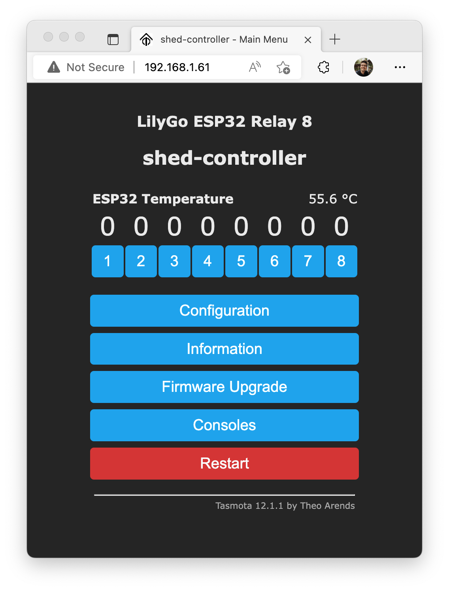

# LilyGo ESP32 Relay (8) & Tasmota

## Overview

LilyGo-T-Relay is a really nicely built board with 4 or 8 relays controlled by an ESP32 chip (see [datasheet][datasheet]). The board is documented in an [official repository][lilygo-t-relay].

It is meant to be programmed with the [Arduino IDE][arduino] but can be flashed with [Tasmota][tasmota] if preferred.

This document outlined the process of flashing the 8-relay board with [Tasmota][tasmota]. While I have not tested the 4-relay board, the process should be similar and only differ in the configuration of [Tasmota][tasmota] (i.e. which GPIO are controlling the various relays).

## Use case

I am flashing the board with [Tasmota][tasmota] so I can control it with [MQTT][mqtt] via [Home Assistant][homeassistant]. The board is controlling low voltage applications in a shed powered by solar.

While power consumption is probably not going to be too much of an issue initially, being able to have more control over deep sleep and such may be needed in the longer run.

## Requirements

1. One T-Relay board

2. One [T-U2T adapter][t-u2t] (⚠ really make sure you buy one along with the board if you don't have one already)

   - It is a bit annoying that this adapter is required (it is not standard) but at least, its schematic is documented so you can do without if you really need
   - I have found that the adapter delivers sufficient power to the board while flashing so an external power supply is not needed
   - Finally, it is not needed to ground the GPIO 0 pin to flash the board when using the adapter

3. An installation of the [T-U2T adapter][t-u2t]'s drivers for your operating system

   Without the driver, the serial connection is unlikely to be stable and allow you to flash the board. Typically `esptool.py` will complain about an incompatible "crystal" if you are not using the right driver.

4. An installation of [`esptool.py`][esptool]

5. An installation of [`esp_flasher`][esp_flasher] (optional but convenient to watch logs)

## Flashing process

*(the process was run and tested on MacOS, steps may differ on different architecture)*

1. Identify the serial port your device is connected to by running:

   ```bash
   ls /dev/tty.* -l
   ```

   In the rest of the process I am using `/dev/tty.wchusbserial537E0022441`.

2. Run `esp_flasher`, identify your device in the "serial port" drop down and click "View Logs" before clicking on the reset button of your board

   This should bring the logs from your board. Here is what they look like for a board successfully flashed with [Tasmota][tasmota]:

   

   This is going to be helpful after flashing to get the IP address of the board and generally diagnose issues.

3. Optionally backup the current firmware by running:

   ```bash
   esptool.py -p /dev/tty.wchusbserial537E0022441 --chip esp32 read_flash 0x00000 0x400000 image.bin
   ```

   You can confirm your firmware is 4MB prior by running:

   ```
   esptool.py -p /dev/tty.wchusbserial537E0022441 --chip esp32 flash_id
   ```

4. Download the latest initial firmware for Tasmota for ESP32 from the [official site][tasmota32]

   ⚠️ The filename should be `tasmota32.factory.bin`.

5. Finally flash the image by running:

   ```bash
    esptool.py --port /dev/tty.wchusbserial537E0022441 --chip esp32 --baud 921600 --before default_reset --after hard_reset write_flash -z --flash_mode dout --flash_size detect 0x0 tasmota32.factory.bin
   ```

From there your board should be running Tasmota and ready to be configured!

## Configuration process

1. Connect to the Wifi network the board is currently broadcasting to select the Wifi network you need to board to connect to

   Once done, the board should output in its logs the IP address is received on your Wifi network.

   Accessing `http://<ip address>` in your browser (while connected to the same network) will prompt the [Tasmota][tasmota] web interface.

2. The following template will setup the relays and the red LED on the board:

   ```JSON
   {"NAME":"LilyGo ESP32 Relay 8","GPIO":[1,1,1,1,1,231,1,1,227,226,1,1,1,1,230,229,0,228,1,1,0,544,1,1,0,0,0,0,225,224,1,1,1,0,0,1],"FLAG":0,"BASE":1}
   ```

   Note that for the 4-relay board, you can refer to the following [template][4-relay-template].

You should be left with the following looking web interface:



Here is a video showing all relays lighting up:

https://user-images.githubusercontent.com/14911070/195472702-d5ba4121-e8db-4d25-b245-70e59a5e2b55.mp4

## Misc

### Power consumption

The board draws less current while powered at 12 volts instead of 24 volts (which its input supports).

At 12 volts,

- Before flashing if memory serves well (for lack of better notes), the board was using ~ 600 mA of current while idle (without a Wifi connection setup and with all relays off).

- Using [Tasmota][tasmota], with all relays on, the board draws 340 mA. With all relays off, it is oscillating between 30 and 50 mA.

<!-- References -->
[lilygo-t-relay]: https://github.com/Xinyuan-LilyGO/LilyGo-T-Relay
[arduino]: https://www.arduino.cc/en/software
[tasmota]: https://tasmota.github.io/docs/
[homeassistant]: https://www.home-assistant.io/
[mqtt]: https://mqtt.org/
[t-u2t]: https://github.com/Xinyuan-LilyGO/T-U2T
[esptool]: https://docs.espressif.com/projects/esptool/en/latest/esp32/
[esp_flasher]: https://github.com/Jason2866/ESP_Flasher
[tasmota32]: https://ota.tasmota.com/tasmota32/release/
[datasheet]: https://www.espressif.com/sites/default/files/documentation/esp32-wrover-e_esp32-wrover-ie_datasheet_en.pdf
[4-relay-template]: https://templates.blakadder.com/lilygo_T-Relay.html